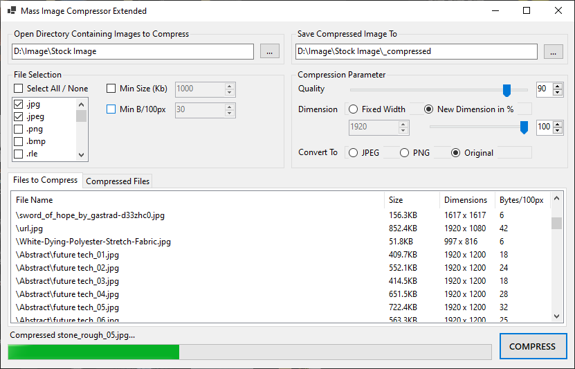

# Mass Image Compressor Extended

> Windows application for compressing image in a batch

<a href="https://drive.google.com/file/d/11HZJprPqRCFA5dQVWn8SlmFBB3hEbtK5/view?usp=sharing">Download the latest build in .zip here</a>

### Disclaimer
This  application is a fork of yogee's <a href="https://sourceforge.net/projects/icompress/">Mass Image Compressor app</a>, utilizing its compression methods while entirely redoing the UI and modifying some behaviors to suit my personal preference. Eventually this application will have more features before being released for public.

#### Tech & Design Pattern
.Net 6, WinForm, Dependency Injection, MVVM, Unit Testing.

#### Preview

