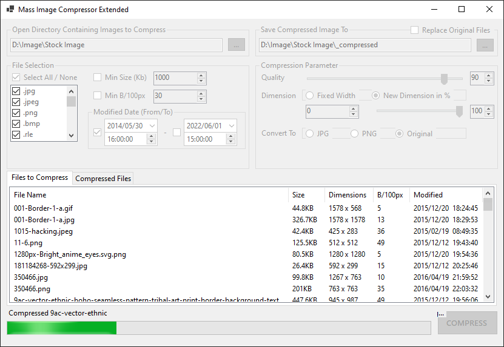

# Mass Image Compressor Extended

Windows application for compressing images in batches.

#### Disclaimer
This application is a fork of yogee's <a href="https://sourceforge.net/projects/icompress/">Mass Image Compressor app</a>, using its compression methods but with a completely redesigned UI and multi-threading support.

#### Tech & Design Pattern
> .Net 6, WinForm, Dependency Injection, MVVM, Unit Testing.

#### Preview

